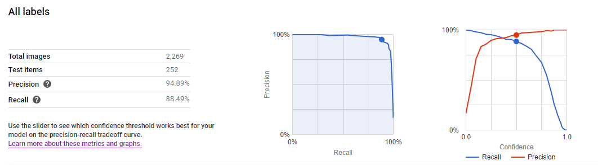

# CleanUpOurSpace

## About
Hackathon Project - MakeUC 2020

Developers: Alexander Remm, Liam Shay, Will Elmore

CleanUpOurSpace is a project designed to help foster a cleaner environment. Our app allows for users to take photos of trash that they pick up and accrue points toward prizes. 

Users will open up the app and will see a live GPS tracker showing their location (similar to other applications like PokemonGo). Using this, the app will be able to see the users surroundings, subsequently allowing for the user to scan trash that they see and pickup. 

Users will gain points by picking up trash and will be able to use these points for gift cards, coupons, and other prizes (to be determined later). We hope this app encourages people to get out in their communities and clean up their streets.

## Screenshots

## Neural Network Training Results

## Try it out yourself!
To try out the app, just download the Android .APK file in the apk folder.
Follow [this](https://www.digitaltrends.com/mobile/how-to-sideload-an-apk/) guide to learn how to install a third-party app on your phone.
